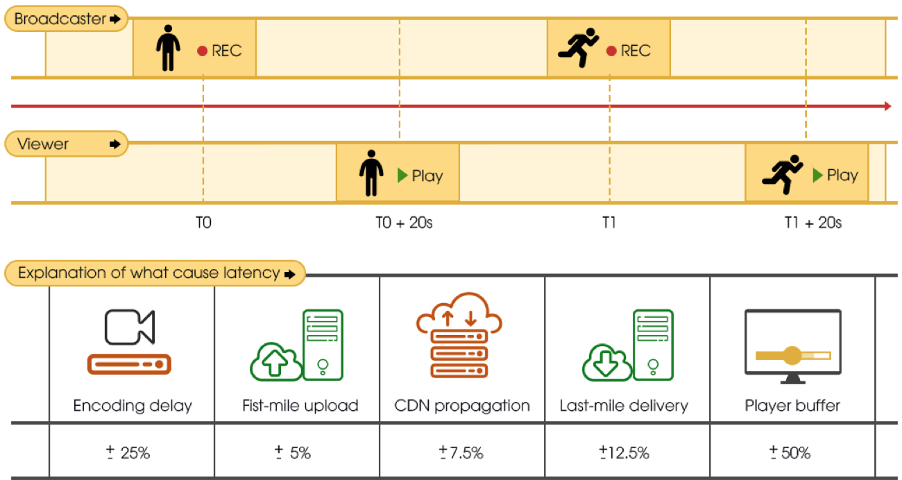

**A technical overview about live streaming infrastructure solutions and Low latency HLS.** 

### Table of content 

 * Introduction

 * Low Latency for live streaming

 * Low Latency HLS 

 * Sigma Live Streaming Paltform

 * Company descriptions 

   

### Introduction

Dịch vụ Live Streaming nơi mà bất kì ai có kết nối internet cũng có thể sáng tạo và đưa nội dung đa phương tiện trực tiếp đến với lượng lớn người xem một cách đơn giản và hiệu quả nhất. Để xây dựng một trải nghiệm live stream tuyệt vời đến người xem của bạn đòi hỏi một dự án kĩ thuật lớn, chi phí cao và rủi ro lớn. Với sự kiện trực tiếp việc đảm bảo nội dung được truyền tải đến người dùng một cách mượt mà ít sự cố là điều tối quan trọng. Bất cứ một sự cố nào trên luồng phát trực tiếp cũng đẩy dịch vụ của bạn đến ... 

Sigma Live Stream Platform cung cấp một dịch vụ toàn diện đưa công việc truyền tải nội dung từ broadcaster đến với người xem đơn giản như một nút bấm.

64% viewer have watched a live online video in the past year.

78% viewer are already watching live video on Facebook live.

82% viewer prefer live video from a brand to social posts.

*“I think it takes more than three seconds to build your brand, and consumers are willing to spend the time if your content is compelling, relevant, and valuable.” – [Momentology](http://www.momentology.com/8936-video-marketing-trends-2016/)*

### What make a live stream successful ? 

Điều gì đảm bảo cho sự thành công của một luồng live stream ?

Đối với một luồng phát trực tiếp, dấu hiệu đảm bảo cho sự thành công là nội dung mà nhà cung cấp tạo ra hướng tới được nhiều đối tượng mong muốn nhất. Tăng trưởng số lượng người xem đồng thời ứng với sự thành công của luồng phát trực tiếp. Để đảm bảo sự thành công đó ngoài việc broadcaster đưa ra những nội dung đặc sắc tập trung vào viewer thì nền tảng công nghệ live stream cũng đóng một vai trò rất quan trọng. 

62% of consumers are more likely to have a negative perception of a brand with a low-quality video experience. – [KZO](https://kzoinnovations.com/video-quality-influence-brand-perception)

Chất lượng dịch vụ khi phát sóng đóng vai trò vô cùng quan trọng đến cảm xúc của người xem. Bên cạnh đó những channel của broadcaster có tương tác với người dùng (example: Q&A, chơi game cùng người xem ...) luôn là những channel thuộc top đầu trên các dịch vụ trực tuyến. Đối với việc tương tác trực tiếp với người dùng độ trễ của hệ thống truyền tải nội dung đến người xem ảnh hưởng 

*Since we started providing our player for apps 15 years ago, video streaming on mobile devices has drastically increased. Many people now expect to access the same content on multiple devices with broadcast quality, whether they are at home or on the go.”* 

*“Having a multiscreen low latency solution is a top requirement for customers and opens the door for fascinating interactive use cases, leveraging the best end-to-end technology and synchronization of the stream among all end users.”* 

*Carlos Lucas, General Manager of NexPlayer at* *NexStreaming* 

### Key drivers of low latency for video streaming 

Early streaming formats, primarily developed for SVOD, focused on avoiding re-buffering when rendering video on a player. But to make that work everywhere on any device, memory buffers had to be used in the workflow, especially in the player. This contributed to the success of OTT but also introduced end-to-end latency. For example, Apple’s original HTTP Live Streaming (HLS) protocol, released in 2009, recommended using 10-second segments and specified that players should not buffer less than three segments. This explains why many OTT services show a typical latency of 40 seconds or even more. Apple later revised its recommendation to six-second segments, but this still equates to 18 seconds of delay just on the client side to be HLS compliant.

Với độ trễ 20-40 giây hoặc hơn thì không phải là vấn đề cho người dùng khi xem VOD. Nhưng đối với sự kiện trực tiếp việc đỗ trễ quá cao sẽ ảnh hưởng đến tính tương tác qua lại giữa người xem và broadcaster. Hình ảnh bên dưới biểu thị tác động của độ trễ và các thành phần tạo ra độ trễ khi truyền tải nội dung

### Low Latency HLS 

Như đã đề cập ở mục trước. The HTTP Live Streaming (HLS) protocol delivers live and on-demand content streams to global-scale audiences. HLS has historically favored stream reliability over latency. Low-Latency HLS extends the protocol to enable low-latency video streaming while maintaining the same degree of scalability. The new low-latency mode lowers video latencies over public networks into the range of standard television broadcasts.

Backend production tools and content delivery systems must implement new rules to enable low-latency stream playback. Low-latency  to stream HLS (LHLS) segments which have not completed transcoding yet. Segments do not need to be complete to be buffered - each segment contains a number of GOPs (group of pictures), and each GOP can be independently transmuxed and appended to a buffer in the playback user agent. Using HTTP chunked transfer encoding, LHLS is able to maintain a persistent connection with a transcoding server; the server, in turn, is able to push partial segments to the client before completion. Additional reductions in latency are possible by negotiating the TCP connection before the segment needs to be buffered.

A biggest challenge to implement LHLS in production is ABR logic:

1. The available buffer is almost zero by design. This means all minimum buffer sizes for ABR switches and LoadControl configurations become practically useless. 
2. The live latency may drift over time because the playback speed (as determined by the renderers) is likely to be not exactly real-time aligned.
3. Rebuffering makes the live latency considerably worse and normal playback speed would never catch up again.Bandwidth estimation based on transfers is only possible if the transfers [happen as fast as possible](https://docs.google.com/document/d/1e3jVkZ6nxNWgCqTNibqV8uJcKo8d597XVl3nJkY7P8c/edit#heading=h.ya5n8kibobz9). 
4. This may not be true for partially available media chunks as they only become available in real-time. Moreover, the actual data transfer may be bursty as new small chunks of data are written and then transferred. Similarly, transferring small sub-segment media pieces (in the Apple LHLS case) likely suffers from [estimation inaccuracies caused by small transfer sizes](https://docs.google.com/document/d/1e3jVkZ6nxNWgCqTNibqV8uJcKo8d597XVl3nJkY7P8c/edit#heading=h.omecbu2809cn).
5. Information about other formats may not be available and loading initialization data or new media playlists causes extra initial start-up time for a new format in which the player may already run out of media. 

### Sigma Live Stream Platform

#### Introduction Description of system 

The Sigma Live Stream platform cho phép người dùng cung cấp nội dung từ bất kì thiết bị nào đến bất kì đâu mong muốn. Điểm quan trọng nhất của dự án là tạo ra một nền tảng hỗ trợ người dùng thao tác để trở thành một broadcaster đơn giản nhất. Hỗ trợ nhiều giải pháp công nghệ cho người phát và người xem. Người phát có thể tuỳ chọn độ trễ truyền phát để kéo gần hơn khoảng cách tương tác với người xem. Người xem sẽ không phải bỏ lỡ bất kì khoảng khắc nào trong sự kiện trực tiếp

#### Feature

- Xử lý lượng lớn luồng transmux & transcode các kênh live stream
- Quản lý nội dung trong và sau khi luồng live stream kết thúc
  - Livestream DVR (xem lại nội dung đã phát trước đó ngay trên luồng live stream)
  - Source Record (Lưu lại tệp nguồn gốc)
  - Catchup (Lưu trữ xem lại luồng trực tiếp cho người xem)
  - Thumbnail (Tự động sinh định kì thumbnail, hỗ trợ livestream thumbnail preview cho cả luồng live và xem lại)
- Monitor livestream event (Preview, start, stop, restream)
- Implement Low Latency HLS (with Ultra Low Latency mode)
- Chọn nhiều chế độ live stream 
  - Normal latency : reduced viewer playback buffering.
    - Choose "Normal latency" if you don't plan to interact with your audience. This is the highest quality setting for viewers since it has the lowest amount of viewer buffering. 
    - latency: ~20-30 seconds
  - Low latency: near real-time interactivity
    - Choose this option if you want low latency with minimal viewer buffering. This setting is a good balance between the other two options. 
    - latency: ~ 8-10 seconds
  - Ultra low latency: highly interactive live streams with real-time engagement
    - Choose this option if you want to maximize engagement with your audience and don't mind increasing the chances that your viewers may buffer more.
    - Latency: ~2-4 seconds
- Monitor, Alert & Analytic live stream metrics
  - Health check system 
  - Alert when system has problem 
  - Backup livestream when system fail
  - Analytic live stream metrics: 
    - CCU 
    - Total view
    - Total Time watch
- Hệ thống có tính sẵn sàng cao, dễ dàng triển khai ... 
- Tối ưu quá tài nguyên và chi phí 
- API đơn giản, dễ sử dụng và tích hợp với mọi hệ thống
  - Api with secure token
  - Webhook for live stream event 

#### Infrastructure of system

##### Broadcaster 

Sigma live stream platform có sdk hỗ trợ cho các nền tảng như android, ios với những tính năng quan trọng: 

* AAC audio encoding, H.264 video encoding (supports soft/hard editing, supports baseline/main/high profile)

* Multi-resolution encoding support 

* Camera control (heading, flash, front and rear camera)

* Adaptively adjust the bit rate of the video according to the network bandwidth, the network adaptive mode can be configured

* Support RTMP protocol live streaming

* Support encode video in low latency mode

 

##### Viewer playback

Trên các thiết bị mobile sử dụng hệ điều hành android và ios, Sigma live stream platform hỗ trợ player playback: 

* Plugin SDK for Exoplayer (required version 2.6 or above) 

* Plugin SDK for AVPlayer

* Support Low Latency HLS 

* Preview thumbnail in livestream

* Support livestream DVR

* Support ABR (Adaptive bitrate) for Low Latency HLS

  * **Setting a suitable initial start position**: Chọn thời điểm start mong muốn để có thể có độ trễ thấp nhất só với luồng trực tiếp. Ví dụ ở chế độ ultra low latency, hệ thống cho bắt đầu luồng phát ở độ trễ 3 giây so với live
  * **Adjusting the playback speed**: Tốc độ của luồng phát được điều trỉnh trong khoảng từ 0.8-1.2 để người xem không phát hiện ra sự thay đổi. Mục đích nhắm kéo dãn buffer của luồng phát đạt đến được độ trễ mong muốn

  

##### RTMP Server

Hệ thống RTMP Server được chia theo khu vực để kết nối với broadcast nhanh nhất có thể, với tính năng tự động scale, hệ thống có thể xử lý được hàng ngàn kết nối

##### S-Transcoder

* Hỗ trợ transmux & transcode kênh live stream với độ trễ thấp, hiệu năng cao 

* Transcode resolution up to UltraHD (4K)

* Full Resolution Control: resize, crop, letterbox, and more 

* Adjustable aspect ratio of the output video 

* Video Filters: Rotate, Denoise, Deinterlace, sharpen, autolevel, deblock, flip, mirror 

* Audio Controls: Normalize, Gain, Equalize, Fade-in, Fade-out, Karaoke, Advanced Audio Levels Control 

* Advanced Audio Resampling 

* Conditional Outputs (min/max size and duration)

* Support mode zero latency for optimize encoding time 

##### Api Server

Hệ thống Api Server cung cấp API giao tiếp với App Server live stream:

* Quản lý livestream event (create, update, remove ...)
* Quản lý livestream asset (DVR, catchup, thumbnail ... )
* Webhook livestream event

##### Monitor

  * Theo dõi hệ thống qua các thông số quan trọng
  * Cảnh báo khi hệ thống gặp sự cố

#### Streaming flow using Sigma Live Streaming platform

- Luồng dữ liệu từ người phát:

  - Đăng nhập hệ thống và yêu cầu tạo luồng phát

  - Hệ thống sinh và trả về **RTMP Server** (tương ứng với vị trí của nguồn phát) và **token** xác thực nguồn phát

  - Bắt đầu phát trực tiếp lên **RTMP Server** 

  - **RTMP Server** xác thực nguồn phát dựa trên token cập nhật metadata vào danh sách kênh

  - Tương tác với người xem 

    

- Luồng dữ liệu từ người xem:

  - Đăng nhập hệ thống à liệt kê danh sách kênh đang phát hoặc đã phát phù hợp (dựa trên vị trí địa lý, độ ưu tiên của kênh, các kênh đã thích …)

  - Chọn kênh muốn xem

  - Hệ thống trả về Edge server (CDN) phù hợp với người xem

  - Xem kênh và tương tác (tán gẫu, gửi quà …)

    

### Company Description

##### Thudo multimedia JSC

(chỗ này giới thiệu về công ty)

(hình ảnh về thông tin liên lạc)