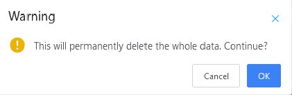

# {{ $frontmatter.title }}

# Basic Configuration Guide

## Import Action

A few notes, as well as the general description information when the user is adding additional action, edit the data in form:

<!--
- Giao diện:

- `Thông báo lỗi`: dữ liệu người dùng nhập trong form cần được kiểm tra lại để đảm bảo đúng định dạng, yêu cầu.

1. Trường dữ liệu không được bỏ trống -->

In a form that will include multiple data fields, each data field will consist of 2 components: *Title* and *OH/select data*.

- Section *header* displays name information. The data field description information will show when moving the mouse pointer to the  icon.

  

  ***

  **\ *Note**

  For data fields with \ * ahead, the data field is not vacated, forcing the user to enter the data before saving form.

  ***

- Section *The data/select* data allows the user to enter/select the desired data.

  User data can sometimes be authenticated to ensure valid, when the user input is not valid for **red** error messages below.

  

  The error message content depends on each specific case. The following examples include a few other types of notifications:

  

  

  

## Data Submit

When the user does confirm the data stored in the form by pressing the **Submit** or **Save**. The task execution system and then return the message to the user:

* If the execs successfully execute, there will be a blue message showing the top of the browser screen.

    

* If the execs failed, there will be a red message, with a bug content showing the top of the browser screen.

    

When the operation with the form/edit the channel, the template will require a variety of data units, these data units are grouped into items in the form.

In the process of data processing, the case with an error occurs, which items in the form currently have errors that will change to **red**, when clicking on those parts, the user will see the error detail.

When the operation with the form creates/edit the template, the user needs to perform multiple steps in order to complete the task.

For example, for the creation of the channel, the two main steps are required:

  

1. Select the type of channel, consisting of two types of *Create new words* and *Created from the template*. After the user completes **steps 1** and clicks the button, the entire user data at this step will be recorded before moving to **steps 2**.

2. Enter the full information necessary. The interface as well as the data will show up depending on the options that the user set up from **steps 1** earlier.

  At step 2, there are a few options for users to navigate the setting up of their data:

  

  * If you press **Submit** will have 3 additional options after successful creation
    * `Submit then stay` users remain in the current page and the data is not lost.
    * `Submit then back` users will be directed to the list page/template.
    * `Save as template` tin is saved as a new template.

  Also, if you want to go back **steps 1** before that, click the  button. However the entire current input data will be deleted, and the system also gives a display message between the screen for the user to confirm prior to the execution.

  

  If you click `OK`, the interface will return to step 1 and the entire data is deleted.

  If you click `Cancel`, the system cancels the return operation.