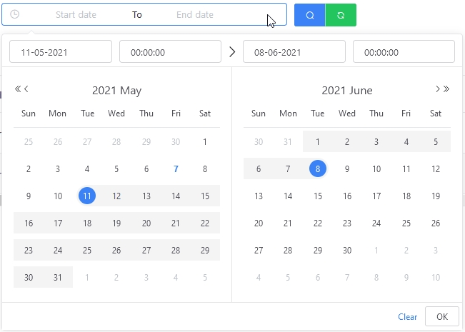
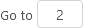

# {{ $frontmatter.title }}

## Operations with service

For a list of content, the application allows the user to interact with each element in the list through a group of functional buttons (See the illustration below). These buttons will show at the final column of the list table.

---

**\ * NOTE**

Due to each section of the content on the app there are different features and careers, so the interface that displays functional buttons may differ slightly.

---

### Detailed description

-  access to interactive online.
-  triggered the active status of the service.
-  Activate service stop status.
-  setting up all of the object's data on the original state.
-  edit the information, display the interface for the selected object's data editing.
-  creating a new object whose data is identical to the original object, while also customisable to a few parameters of the new object to fit.
-  Delete the selected object. Before the implementation of the application will require the user to authenticate again.

## Auto Refresh

Allow shortcuts to automatically update the data after a certain amount of time.

There are five values to choose: *Turn* and intervals *Time 5s*, *Time 10s*, *Time 15s*, *Time 20s* corresponds to the time values of 5 seconds, 10 seconds, 15 seconds and 20 seconds will automatically update the new data for the user.

## Filter

In the contents of the table list, there is filter feature support, search for elements in one or a few specific conditions. The filter is displayed above each table.

After the completion of the filter/filtration, the valid elements are displayed on the interface.

### Livestream Filter

The livestream filter allows users to search for data according to the data fields as follows (from left to right on the description):

- `Search` named livestream, the username livestream.
- `Status` the livestream state, consisting of 4 selections **Init**, **Live**, **Ended**, **Error**.

  

- `Tag` tag assigned to livestream, user input tag.
- `Publisher` The publisher livestream.
- `Start date-End date` day start and date ending livestream.

  

The user can search by entering multiple fields at the same time, then press the confirmation button to search for, or press the {height=17px} `Reset` to remove all previously imported information.

### Channel Filter

The channel filter allows users to search for data according to the data fields as follows (from left to right on the description):

- `Status` The channel state, consisting of four options: `All`, `Live`, `Stated`, `Error`.
- `Type` types of channels, including 2 options `Package`, `Transcode`.

  

- `Tag` tag assigned to the channel, user input tag.
- `Name` locating the channel, the user name entry requires a search.

## Page

Perform the cataract correction actions with a list of lists that are listed in the list.

The page interface consists of four main components:

- Total number of available elements.

  

- The option of the number of elements displayed on a page.<!-- !\[Fontsize Menu\](../images/um-pagination/page-size.png) -->

  It is possible to choose `5`, `10`, `15`, `20`, `50`, `100` elements display on a page by selecting the corresponding values in the page menu, the default value is `10`.

- The current order.

  

  - List existing pages.
  - The current page is highlighted in blue {height=17px}.
  - Move to the previous page/next page by selecting the symbol {height=17px} and {height=17px}.

- Move to any page.

  

  It can be moved to any page by entering the order number of the page in the picture above.

