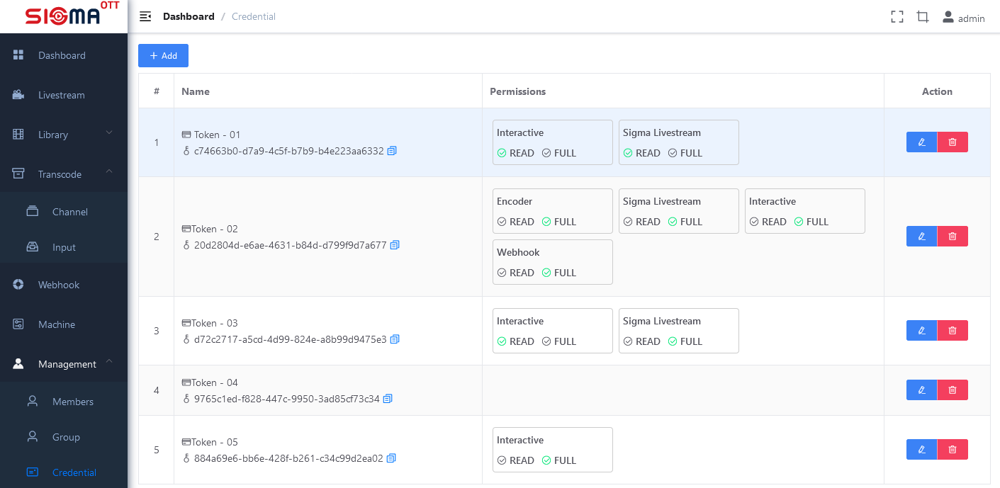
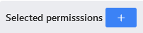
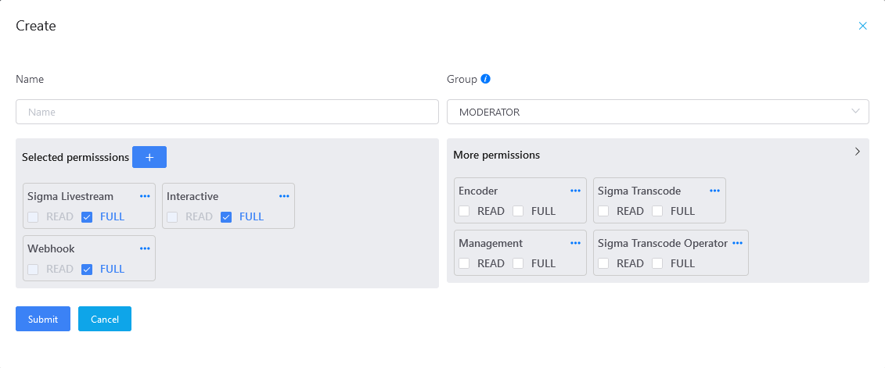

# Management System

User-managed administration system, api access token to the system

## Basic authentication

Manage the system to use on the system.

### List of basic authentications

Each token value will include the basic parameters:

- Name.
- Right.

  To better understand the rights, access section **Decline**.

---

**\ * NOTE**

A token will be assigned one or more rights.

---

### Create token

1. Click on button .
2. Enter the token information in form.

    

    When performing an assignment to the token, it is possible to select the permissions available in the list of groups. Then, the token will inherit all the rights of the selected group. It is possible to edit (add sur/delete) the inherited rights to the appropriate.

    Click the  button to display more lists of rights.

    

3. Save the token by clicking the  button.

  Token new execution system:
  - If successful token information is created: 

    Click on  symbols of Token ID and Token Secret. The Token Secret value will be deleted soon after.

  - If the failure will show the error message.

### Edit token

Click on the  button to change the name, the permissions of the token.

## Group

Manage User Groups

### Group List

Each group will consist of two basic parameters:

- Name (column **Name** in the above table).
- List of rights (column **Permissions** in the above table).

  To better understand the rights, access section **Decline**.

---

**\ * NOTE**

A group consists of one or several rights. The accounts in the group are inherited all of that group.

---

### Create Group

1. Click on button .
2. Enter the account information in form.

    

    The information to import includes:
    - Name.
    - Password.
    - The powers.
3. Save the group by clicking the  button.

  Group new execution system:
  - If successful display success is successful.
  - If the failed display failure

### Edit account rights

Click on the  button to edit the group ' s name information and rights.

## Member

Manage the list of user accounts on the system.

### Account List

Each account will include a few basic parameters:

- Login name (column **User** in the above table).
- The group/rights to which the account is assigned (column **Group** in the above table).

Move the mouse into the group to show the copyright details.

  

  To better understand the rights, access section **Decline**.

---

**\ * NOTE**

An account will be a member of one and only one group.

---

### Create Account

1. Click on button .
2. Enter the account information in form.

    

    The information to import includes:
    - Login name.
    - Password.
    - The group will empower.

      The selected group will display the blue tick 
3. Save the account by clicking the  button.

  The new implementation execution system:
  - If the successful display of account information is generated including the login name and password: .

    Click on ,   to display and copy passwords.

  - If the failure will show the error message.

### Edit account rights

Click on the  button to change the rights of the account by assigning an account to another group.

## Permission

An account is created and granted a certain number of powers and is only executed by the right to be executed.

### Devolve Rules

On the system will be divided into various rights, each of which will include two basic information:

- Identifier: in order to refer to the object, the entity in which the right will impact.

  For example, the power `Sigma Livestream` represents the object in which the right effect is `Livestream`.
- Action: the expression of actions allowed on the entity to assign to the right. It &apos; s the answer to the *question, what can be done with the A?*

  The system defines two actions to work with the right:
  - READ: The user can only view the entity information.
  - FULL: The user can view and edit the entity information.

    When establishing the right, it is only possible to select one of the two actions.

For example, the interface displays a right on the system

  
