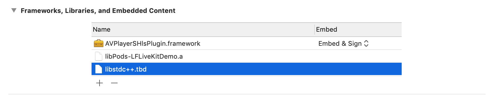
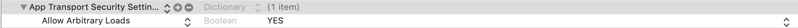

## Tài liệu tích hợp AVPlayerSHlsPlugin iOS

### 1. Add framework to project
Kéo thả AVPlayerSHlsPlugin.framework vào project. Sau đó add framework như hình:



### 2. Tích hợp module AVPlayerSHlsPlugin

#### 2.1. Khai báo App Transport Security Setting trong file Info.plist



#### 2.2. Khởi tạo AVPlayer

```objectivec
NSURL *url = [NSURL URLWithString:url];
AVURLAsset *asset = [AVURLAsset URLAssetWithURL:url options:nil];
self.playerItem = [AVPlayerItem playerItemWithAsset:asset];
self.player = [AVPlayer playerWithPlayerItem:self.playerItem];
self.playerLayer= [AVPlayerLayer playerLayerWithPlayer:self.player];
self.playerLayer.frame = self.view.bounds;
[self.view.layer addSublayer:self.playerLayer];
```

#### 2.3. Khởi tạo AVPlayerSHlsPlugin

```
self.avplayerShlsPlugin = [[AVPlayerSHlsPlugin alloc] init];
[self.avplayerShlsPlugin initSession:self.player playItem:self.playerItem];
```

#### 2.4. Play video

```
[self.player play];
```

#### 2.5. Pause video

```
[self.player pause];
```

#### 2.6. Kiểm tra trạng thái video

```
[self.avplayerShlsPlugin isPlaying];
```

#### 2.7. Đăng ký nhận sự kiện LiveStreamPause và LiveStreamResume

1. implement AVPlayerSHlsPluginDelegate

```
@interface ViewController ()<AVPlayerSHlsPluginDelegate>
...
@end
```
1. set Delegate cho AVPlayerSHlsPlugin

```
[self.avplayerShlsPlugin setDelegate:self];
```

1. Khai báo các hàm để nhận thông báo khi có sự kiện.
	
```
- (void)onLiveStreamPause{
    NSLog(@"onLiveStreamPause");
}

- (void)onLiveStreamResume{
    NSLog(@"onLiveStreamResume");
}
```