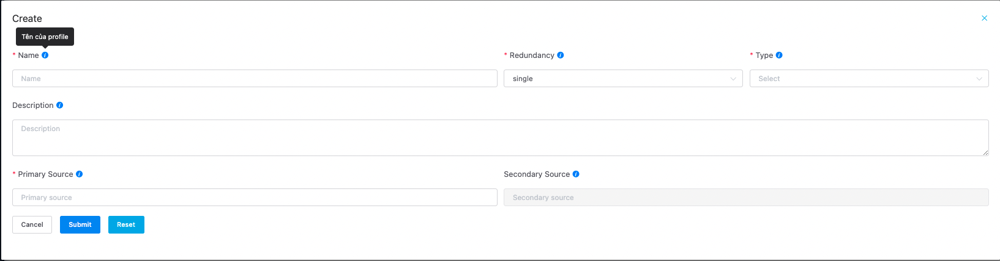

# {{ $frontmatter.title }}

Bạn phải tạo một đầu vào \. Đầu vào xác định luồng dữ liệu media mà hệ thống Sigma Transcode Live sử dụng để chuyển mã hoặc đóng gói \.

Hệ thống Sigma Streaming Platform hỗ trợ các chuẩn đầu vào sau: 
- MPEG-TS over multicast UDP
- RTMP push
- RTMP pull
- RTP 
- RTCP 
- SRT push
- SRT pull 

**Ví dụ về tạo 1 đầu vào UDP multi ast**

1. Sign in to the Sigma Streaming portal and open the MediaLive console at [https://console\.aws\.amazon\.com/medialive/](https://console.aws.amazon.com/medialive/)\.

2. Nhấn nút **Add** ở menu **Input** trong mục **Transcode**. Giao diện khởi tạo Input sẽ hiện lên

3. Nhập các thông tin cần thiết
   1. **Tên** của input 
   2. **Redundancy** chọn **single**
   3. **Type** chọn **UDP**
   4. **Primary Source** điền thông tin về luồng đã chuẩn bị ở bước 1 [Cài đặt luồng đầu vào](3-getting-started-step1.md)
   5. **Primary Interface Network** vui lòng chọn 1 card mạng nhận luồng udp multicast này bỏ qua 

::: tip Lưu ý

Nếu không điền thông tin về card mạng thì hệ thống sẽ tự lấy ở card mạng mặc định

:::