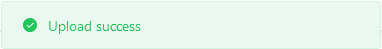
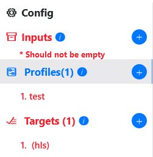
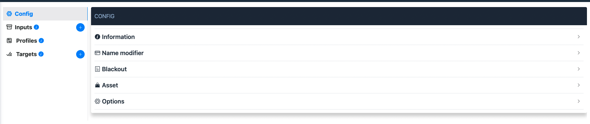

# Cấu hình dịch vụ

## Hướng dẫn cấu hình cơ bản

### Thao tác nhập liệu

Một vài lưu ý, cũng như thông tin mô tả chung khi người dùng thao tác thêm, sửa dữ liệu trong form:

<!--
- Giao diện:

- `Thông báo lỗi`: dữ liệu người dùng nhập trong form cần được kiểm tra lại để đảm bảo đúng định dạng, yêu cầu.

1. Trường dữ liệu không được bỏ trống -->

Trong một form sẽ bao gồm nhiều trường dữ liệu, mỗi trường dữ liệu sẽ bao gồm 2 thành phần: *Tiêu đề* và *Ô nhập/chọn dữ liệu*.

- Phần *tiêu đề* hiển thị thông tin tên. Thông tin mô tả trường dữ liệu sẽ hiển thị khi di chuyển con trỏ chuột vào biểu tượng .

  

  ***

  **\*Note**

  Đối với trường dữ liệu có biểu tượng \* phía trước, thì trường dữ liệu không được bỏ trống, bắt buộc người dùng phải nhập dữ liệu trước khi lưu form.

  ***

- Phần *Ô nhập/chọn dữ liệu* cho phép người dùng nhập/chọn dữ liệu mong muốn.

  Dữ liệu người dùng đôi khi cần được xác thực để đảm bảo hợp lệ, khi dữ liệu người dùng nhập không hợp lệ sẽ có thông báo lỗi **màu đỏ** hiển thị ngay phía dưới.

  

  Nội dung thông báo lỗi tùy thuộc từng trường hợp cụ thể. Sau đây ví dụ thêm một vài loại thông báo khác:

  

  

  

### Submit dữ liệu

Khi người dùng thực hiện xác nhận dữ liệu lưu trữ trong form bằng cách ấn nút **Submit** hoặc **Save**. Hệ thống thực thi tác vụ và sau đó sẽ trả về thông báo cho người dùng:

* Nếu tác vụ thực thi thành công, sẽ có thông báo màu xanh hiển thị phía trên của màn hình trình duyệt.

    

* Nếu tác vụ thực thi không thành công, sẽ có thông báo màu đỏ, kèm nội dung lỗi hiển thị phía trên của màn hình trình duyệt.

    

Khi thao tác với form tạo/chỉnh sửa kênh, template sẽ yêu cầu nhiều đơn vị dữ liệu khác nhau, các đơn vị dữ liệu này được nhóm lại thành các mục trong form.

Trong quá trình hệ thống xử lý dữ liệu, trường hợp có lỗi xuất hiện, những mục nào trong form hiện có lỗi sẽ đổi thành **màu đỏ**, khi nhấp vào những phần đó, người dùng sẽ thấy được chi tiết lỗi.

Khi thao tác với form tạo/chỉnh sửa kênh/template, người dùng cần thực hiện lần lượt nhiều bước để có thể hoàn thành tác vụ.

Ví dụ: đối với việc tạo mới kênh, cần thực hiện 2 bước chính:

  

1. Chọn loại kênh, bao gồm 2 loại là *Tạo mới từ đầu* và *Tạo từ template*.
  Sau khi người dùng hoàn thành **bước 1** và nhấp vào nút , toàn bộ dữ liệu người dùng tại bước này sẽ được ghi nhận trước khi chuyển sang **bước 2**.

2. Nhập đầy đủ thông tin cần thiết.
  Giao diện cũng như dữ liệu sẽ hiện thị tùy thuộc vào những tùy chọn mà người dùng đã thiết lập từ **bước 1** trước đó.

  Tại bước 2, có một vài tùy chọn để người dùng điều hướng việc thiết lập dữ liệu của mình:

  

  * Nếu người nhấn **Submit** sẽ có thêm 3 tùy chọn sau khi tạo thành công
    * `Submit then stay` người dùng vẫn tiếp tục ở lại trang hiện tại và dữ liệu không bị mất.
    * `Submit then back` người dùng sẽ được điều hướng sang trang danh sách kênh/template. 
    * `Save as template` tin được lưu lại như một template mới.

  Ngoài ra, nếu muốn quay lại **bước 1** trước đó, nhấp vào nút . Tuy nhiên toàn bộ dữ liệu được nhập hiện tại sẽ bị xóa, đồng thời hệ thống cũng đưa ra thông báo hiển thị giữa màn hình để người dùng xác nhận trước khi thực hiện.

  

  Nếu nhấn `OK`, giao diện sẽ quay lại bước 1 và toàn bộ dữ liệu bị xóa.
  
  Nếu nhấn `Cancel`, hệ thống hủy thao tác quay lại.

## Cấu hình Đầu vào (Input)

Hệ thống hỗ trợ việc cấu hình Input và đính kèm vào kênh mong muốn

### Tạo Input

1. Nhấn nút **Add** ở menu **Input** trong mục **Transcode**. Giao diện khởi tạo Input sẽ hiện lên
2. Nhập các thông tin cần thiết

## Cấu hình Kênh

### Cấu hình kênh cơ bản
1. Nhấn nút **Add** ở danh sách channel khi chọn  menu **channel** trong mục **Transcode** ở sidebar. Giao diện khởi tạo lựa chọn khởi tạo kênh sẽ hiện ra

{ width=400px }

2. Tại giao diện lựa chọn khi khởi tạo kênh, bạn sẽ có 2 lựa chọn là: 
    1. khởi tạo thủ công với 2 loại kênh được liệt kê sẵn:
        1. **Transcode**: Kênh chuyển mã 
        2. **Package**: Kênh đóng gói 

			
		
    2. khởi tạo kênh dựa trên 1 mẫu có sẵn đã được lưu (**From Template**)
    
    

3. Chọn **Next** để tiến hành bước tiếp theo

### Tạo kênh đóng gói thủ công

Kênh đóng gói (package) thực hiện việc chuẩn bị và bảo vệ video của bạn để phân phối qua Internet thông qua các định dạng truyền tải dữ liệu nội dung đa phương tiện qua giao thức http (HTTP Adaptive Stream) như HLS, DASH

Để tạo một kênh đóng gói thủ công, ta thực hiện các bước tạo kênh cơ bản. vui lòng chọn theo hướng dẫn 

- **Manual** => **Package** => **Next**

Màn hình giao diện dành cho việc cấu hình kênh đóng gói hiện ra như sau: 

Trong đó menu bar bên phải sẽ có các mục như sau: 

1. **Config**: Cấu hình cơ bản của kênh
2. **Inputs**: Cấu hình luồng đầu vào
3. **Profiles**: Danh sách các Profile sử dụng
4. **Targets**: Cấu hình danh sách các đầu ra mong muốn (HLS/DASH ... )

Notes: 

* Đối với kênh đóng gói hệ thống sẽ tự động cấu hình **Profile** tương ứng với **Input** được thêm vào. Vì vậy bạn chỉ việc thêm các giá trị **Input** các giá trị **Profile** sẽ được tự động thêm vào và bạn không có quyền thay đổi các giá trị này

#### Cấu hình Config

Trong cấu hình kênh đóng gói cơ bản được chia thành các mục sau: 

- **Information**:
    - **Name**: Tên của kênh dùng để phân biệt và tìm kiếm kênh ở danh sách kênh
    - **Description**: Mô tả kênh
    - **Tags**: Danh sách các tags 
- **Name modifier**: Tên thay thế của kênh phải là duy nhất trên toàn bộ hệ thống, phục vụ việc truy vấn tệp tin manifest 1 cách ngắn gọn
    - Ví dụ: nếu đặt tên thay thế là **VTV1**: link truy cập manifest sẽ có dạng là: *http://origin/com/manifest/VTV1/manifest_name*
- **Blackout**: Cấu hình thay đổi  nội dung đóng gói khi quá trình truyền mạng gặp sự cố và xoá bỏ trạng thái khi quá trình truyền tải nội dung được  tiếp tục (Nội dung sẽ được thay đổi bằng hình ảnh được cấu hình)
- **Options**: Cấu hình nâng cao của kênh

#### Cấu hình đầu vào (Inputs) của kênh

Chọn nút Cộng để thêm đầu vào cho kênh. Danh sách đầu vào đã liệt kê sẵn sẽ hiện ra. Vui lòng chọn đầu vào cho kênh mong muốn

* Hệ thống hỗ trợ việc thêm nhiều đầu vào với 1 kênh 
* Với mỗi đầu vào mong muốn *popup* chọn tên thay thế cho **profile** đóng gói ứng với đầu vào sẽ hiện ra. vui lòng chọn tên thay thế duy nhất với các **profile** khác của kênh
    * Tên thay thế này giúp hệ thống định nghĩa tên profile mong muốn đối với tập profile ABR. Ví dụ với luồng đầu vào là **1080p** bạn nên đặt tên thay thế cho profile là **1080p** 
* nhấn Confirm để xác nhận tên thay thế
* Lần lượt thêm các đầu vào và tên thay thế **profile** mong muốn

#### Cấu hình Đầu ra đóng gói (Targets) của kênh

Chọn phím **Cộng** ở mục Target để thêm 1 đầu ra mong muốn. Popup hiển thị các đầu ra mong muốn sẽ hiện ra. Hệ thống hỗ trợ các đầu ra như sau: 

* **HLS**: Apple Http Live Streaming
* **DASH**: DASH
* **UDP**: multicast hoặc unicast mpeg transport stream
* **RTMP**: Realtime Message Protocol

Sau khi đã khởi tạo 1 đầu ra mong muốn. Cấu hình của đầu ra sẽ hiện ra như sau. Trong đó: 

* **Data**: Cấu hình cơ bản của đầu ra
    * **Name**: Tên của đầu ra
    * **Replaced name**: Tên thêm vào cuối tập tin manifest nguồn, phải là duy nhất đối với các đầu ra khác nhau cùng loại HLS hoặc DASH, phục vụ việc tạo đường dẫn duy nhất cho các tập tin manifest của HLS hoặc DASH, nên được bắt đầu bằng dấu "_" hoặc "-". Có thể để là rỗng "" nếu bạn muốn giữ nguyên tên tập tin manifest nguồn
        * Ví dụ: Nếu bạn để rỗng, tập tin manifest nguồn của HLS sẽ có tên là **master.m3u8** với Dash là **master.mpd**
        * Ví dụ: Nếu bạn để là "**-tv360**, tập tin manifest nguồn của HLS sẽ có tên là **master-tv360.m3u8** với Dash là **master.mpd**
    * **Format**: Tên của loại đầu ra
    * **Description**: Mô tả đầu ra
* **Manifest**: Cấu hình tập tin **manifest** và **segment**
    * **Container**: Định dạng tập tin **segment**. Có giá trị là **mpeg-ts** hoặc **fmp4**. Mặc định là **mpeg-ts**
    * **TS**: Độ dài của 1 tập tin **segment**. Mặc định là 6 giây
    * **Counter**: Số lượng tập tin Segment được lưu trong file **manifest**
    * **Time**: bật tắt hiển thị tag: **Programing-date-time**  sử dụng với đầu ra là HLS
* **DRM**: Cấu hình mã hoá DRM
    * **Enable**: Cấu hình bật tắt DRM
    * **Key provider**: Phương thức cung cấp key mã hoá, tĩnh hoặc lấy từ server chứa key mã hoá
        * **static**: key mã hoá tĩnh
        * **sigma-drm**: Hệ thống mã hoá Sigma Drm
        * **Sigma-drm-v1**: Hệ thống mã hoá Sigma DRM V1
        * **Sigma-multi-drm**: Hệ thống mã hoá Multi-DRM hỗ trợ Widevine, PlayReady, FairPlay được triển khai bởi Sigma drm
    * **Asset Id**: Id sử dụng cho hệ thống drm mã hoá kênh, sử dụng cho sigma drm hoặc sigma multi drm
    * **App ID**: AppId của hệ thông sigma drm,sigma multi drm
    * **Merchant ID**: MerchantId của hệ thông sigma drm,sigma multi drm
    * **User**: User đăng nhập hệ thống sigma drm,sigma multi drm
    * **Password**: Password hệ thống sigma drm,sigma multi drm
* **Low Latency**: Cấu hình truyền hình độ trễ thấp
* **Catchup**: Cấu hình Lưu trữ Catchup-timeshift
    * **Storage**: Bật tắt chế độ lữu trữ catchup-timeshift
    * **Cache time**: Cấu hình thời gian lưu trữ mong muốn đơn vị được tính bằng giờ
* **Preset**: Cấu hình các profile được đóng gói vào đầu ra này

Hướng dẫn cấu hình **preset** với đầu ra: 

1. chọn { width=17px } để lựa chọn các profile sẽ được đóng gói trong đầu ra này. Bảng danh sách profile sẽ được hiện ra
2. tích vào ô vuông để chọn các **profile** bạn muốn thêm vào đầu ra => nhấn **submit** để hoàn thành thao tác
3. Bảng danh sách các profile được chọn sẽ hiện ra, bạn có thể thao tác các tác vụ mong muốn đối với danh sách này như thêm, xoá, sửa

Hướng dẫn cấu hình DRM của đầu ra ứng với mỗi 1 **Key provider**

1. **Static**

| Tên trường  | Miêu tả                                                      |
| ----------- | ------------------------------------------------------------ |
| **Key**     | Key mã hoá tĩnh đã được encode dưới dạng base64              |
| **Key ID**  | KeyId mã hoá tĩnh đã được encode dưới dạng base 64           |
| **Key URI** | Đường dẫn keyUri được đặt vào tập tin manifest .m3u8 để lấy client có thể lấy key mã hoá |

2. **Sigma multi drm**

| Tên trường      | Miêu tả                                                      |
| --------------- | ------------------------------------------------------------ |
| **AssetId**     | **Id** sử dụng cho hệ thống drm mã hoá kênh, sử dụng cho sigma drm hoặc sigma multi drm |
| **App ID**      | **AppId** của hệ thốnng sigma drm,sigma multi drm            |
| **Merchant ID** | **MerchantId** của hệ thông sigma drm,sigma multi drm        |
| **Email**       | User đăng nhập hệ thống sigma drm,sigma multi drm            |
| **Password**    | Password hệ thống sigma drm, sigma multi drm                 |

* Note:
    * Với Key provider sử dụng hệ thống Sigma multi drm, vui lòng lấy đẩy đủ các thông tin từ trang cms của hệ thống Sigma Drm bao gồm (AppId, MerchantID, Email, password)

