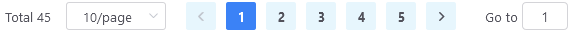
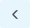
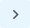

# Quản lý dịch vụ

## Các thao tác với dịch vụ

Đối với những phần nội dung có dạng danh sách, ứng dụng cho phép người dùng tương tác với từng phần tử trong danh sách thông qua một nhóm các nút chức năng (Xem hình minh họa dưới đây).
Các nút này sẽ hiển thị tại cột cuối cùng của bảng danh sách.

---

**\* NOTE**

Do mỗi phần nội dung trên ứng dụng có những tính năng và nghiệp vụ khác nhau, do đó, phần giao diện hiển thị các nút chức năng có thể khác nhau đôi chút.

---

### Mô tả chi tiết

-  truy cập chức năng tương tác trực tuyến.
-  kích hoạt trạng thái hoạt động của dịch vụ.
-  kích hoạt trạng thái dừng dịch vụ.
-  thiết lập toàn bộ dữ liệu của đối tượng về trạng thái ban đầu.
-  chỉnh sửa thông tin, hiển thị giao diện cho phép chỉnh sửa dữ liệu của đối tượng được chọn.
-  tạo một đối tượng mới có dữ liệu giống hệt với đối tượng ban đầu, đồng thời cũng có thể tùy chỉnh một vài thông số của đối tượng mới để phù hợp.
-  xóa đối tượng được chọn. Trước khi ứng dụng thực hiện xóa sẽ yêu cầu người dùng xác thực lại một lần nữa.

## Auto Refresh

Cho phép bật tắt tính năng tự động cập nhật lại dữ liệu sau từng khoảng thời gian nhất định.

Có 5 giá trị để lựa chọn: *Tắt* và các khoảng thời gian *Thời gian 5s*, *Thời gian 10s*, *Thời gian 15s*, *Thời gian 20s* tương ứng với các giá trị thời gian 5 giây, 10 giây, 15 giây và 20 giây sẽ tự động cập nhật dữ liệu mới cho người dùng.

## Filter

Trong các phần nội dung có dạng danh sách bảng, có hỗ trợ tính năng lọc, tìm kiếm các phần tử theo một hoặc một vài điều kiện cụ thể. Bộ lọc được hiển thị phía trên của mỗi bảng.

Sau khi hoàn thành tìm kiếm/lọc, các phần tử hợp lệ sẽ được hiển thị trên giao diện.

### Livestream Filter

Bộ lọc livestream cho phép người dùng tìm kiếm dữ liệu theo các trường dữ liệu như sau (từ trái sang phải trên hình mô tả):

- `Search` định danh livestream, người dùng nhập tên livestream cần tìm kiếm.
- `Status` trạng thái livestream, bao gồm 4 lựa chọn **Init**, **Live**, **Ended**, **Error**.

  

- `Tag` tag gán cho livestream, người dùng nhập tag.
- `Publisher` tên nhà phát hành livestream.
- `Start date - End date` ngày khởi tạo và ngày kết thúc livestream.

  

Người dùng có thể tìm kiếm bằng cách nhập nhiều trường giá trị cùng lúc, sau đó ấn nút xác nhận để tìm kiếm, hoặc ấn nút { height=17px } `Reset` để xóa bỏ toàn bộ thông tin đã nhập trước đó.

### Channel Filter

Bộ lọc kênh cho phép người dùng tìm kiếm dữ liệu theo các trường dữ liệu như sau (từ trái sang phải trên hình mô tả):

- `Status` trạng thái kênh, bao gồm 4 lựa chọn: `All`, `Live`, `Stopped`, `Error`.
- `Type` loại kênh, bao gồm 2 lựa chọn `Package`, `Transcode`.

  

- `Tag` tag gán cho kênh, người dùng nhập tag.
- `Name` định danh kênh, người dùng nhập tên kênh cần tìm kiếm.

## Phân trang

Thực hiện các thao tác điều chỉnh phân trang với các phần nội dung có dạng danh sách liệt kê.

Giao diện phân trang bao gồm 4 thành phần chính:

- Tổng số lượng phần tử hiện có.

  

- Tùy chọn số lượng phần tử hiển thị trên một trang.

  <!--  -->

  

  Có thể tùy chọn `5`, `10`, `15`, `20`, `50`, `100` phần tử hiển thị trên một trang bằng cách chọn các giá trị tương ứng trong menu phân trang, giá trị mặc định là `10`.

- Thứ tự trang hiện tại.

  

  - Liệt kê các trang hiện có.
  - Trang hiện tại được tô bằng màu nền xanh { height=17px } .
  - Di chuyển tới trang trước đó/trang kế tiếp lần lượt bằng cách chọn vào biểu tượng { height=17px } và { height=17px } .

- Di chuyển tới một trang bất kỳ.

  
  
  Có thể di chuyển tới một trang bất kỳ bằng cách nhập số thứ tự của trang vào ô trong hình trên

