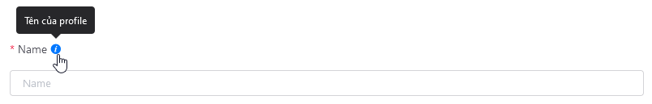
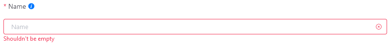
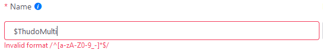
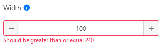
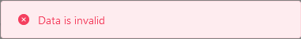
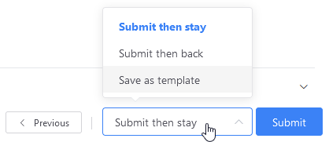

# {{ $frontmatter.title }}

# Hướng dẫn cấu hình cơ bản

## Thao tác nhập liệu

Một vài lưu ý, cũng như thông tin mô tả chung khi người dùng thao tác thêm, sửa dữ liệu trong form:

<!--
- Giao diện:

- `Thông báo lỗi`: dữ liệu người dùng nhập trong form cần được kiểm tra lại để đảm bảo đúng định dạng, yêu cầu.

1. Trường dữ liệu không được bỏ trống -->

Trong một form sẽ bao gồm nhiều trường dữ liệu, mỗi trường dữ liệu sẽ bao gồm 2 thành phần: *Tiêu đề* và *Ô nhập/chọn dữ liệu*.

- Phần *tiêu đề* hiển thị thông tin tên. Thông tin mô tả trường dữ liệu sẽ hiển thị khi di chuyển con trỏ chuột vào biểu tượng .

  

  ***

  **\*Note**

  Đối với trường dữ liệu có biểu tượng \* phía trước, thì trường dữ liệu không được bỏ trống, bắt buộc người dùng phải nhập dữ liệu trước khi lưu form.

  ***

- Phần *Ô nhập/chọn dữ liệu* cho phép người dùng nhập/chọn dữ liệu mong muốn.

  Dữ liệu người dùng đôi khi cần được xác thực để đảm bảo hợp lệ, khi dữ liệu người dùng nhập không hợp lệ sẽ có thông báo lỗi **màu đỏ** hiển thị ngay phía dưới.

  

  Nội dung thông báo lỗi tùy thuộc từng trường hợp cụ thể. Sau đây ví dụ thêm một vài loại thông báo khác:

  

  

  

## Submit dữ liệu

Khi người dùng thực hiện xác nhận dữ liệu lưu trữ trong form bằng cách ấn nút **Submit** hoặc **Save**. Hệ thống thực thi tác vụ và sau đó sẽ trả về thông báo cho người dùng:

* Nếu tác vụ thực thi thành công, sẽ có thông báo màu xanh hiển thị phía trên của màn hình trình duyệt.

    

* Nếu tác vụ thực thi không thành công, sẽ có thông báo màu đỏ, kèm nội dung lỗi hiển thị phía trên của màn hình trình duyệt.

    

Khi thao tác với form tạo/chỉnh sửa kênh, template sẽ yêu cầu nhiều đơn vị dữ liệu khác nhau, các đơn vị dữ liệu này được nhóm lại thành các mục trong form.

Trong quá trình hệ thống xử lý dữ liệu, trường hợp có lỗi xuất hiện, những mục nào trong form hiện có lỗi sẽ đổi thành **màu đỏ**, khi nhấp vào những phần đó, người dùng sẽ thấy được chi tiết lỗi.

Khi thao tác với form tạo/chỉnh sửa kênh/template, người dùng cần thực hiện lần lượt nhiều bước để có thể hoàn thành tác vụ.

Ví dụ: đối với việc tạo mới kênh, cần thực hiện 2 bước chính:

  

1. Chọn loại kênh, bao gồm 2 loại là *Tạo mới từ đầu* và *Tạo từ template*.
  Sau khi người dùng hoàn thành **bước 1** và nhấp vào nút , toàn bộ dữ liệu người dùng tại bước này sẽ được ghi nhận trước khi chuyển sang **bước 2**.

2. Nhập đầy đủ thông tin cần thiết.
  Giao diện cũng như dữ liệu sẽ hiện thị tùy thuộc vào những tùy chọn mà người dùng đã thiết lập từ **bước 1** trước đó.

  Tại bước 2, có một vài tùy chọn để người dùng điều hướng việc thiết lập dữ liệu của mình:

  

  * Nếu người nhấn **Submit** sẽ có thêm 3 tùy chọn sau khi tạo thành công
    * `Submit then stay` người dùng vẫn tiếp tục ở lại trang hiện tại và dữ liệu không bị mất.
    * `Submit then back` người dùng sẽ được điều hướng sang trang danh sách kênh/template. 
    * `Save as template` tin được lưu lại như một template mới.

  Ngoài ra, nếu muốn quay lại **bước 1** trước đó, nhấp vào nút . Tuy nhiên toàn bộ dữ liệu được nhập hiện tại sẽ bị xóa, đồng thời hệ thống cũng đưa ra thông báo hiển thị giữa màn hình để người dùng xác nhận trước khi thực hiện.

  

  Nếu nhấn `OK`, giao diện sẽ quay lại bước 1 và toàn bộ dữ liệu bị xóa.
  
  Nếu nhấn `Cancel`, hệ thống hủy thao tác quay lại.