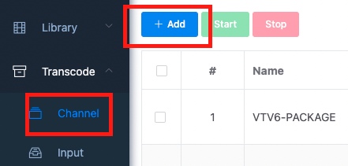
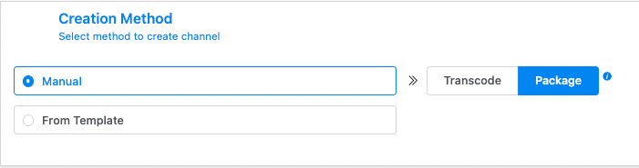

# {{ $frontmatter.title }}

1. Nhấn nút **Add** ở danh sách channel khi chọn  menu **channel** trong mục **Transcode** ở sidebar. Giao diện khởi tạo lựa chọn khởi tạo kênh sẽ hiện ra

{ width=400px }

2. Tại giao diện lựa chọn khi khởi tạo kênh, bạn sẽ có 2 lựa chọn là: 
    1. khởi tạo thủ công với 2 loại kênh được liệt kê sẵn:
        1. **Transcode**: Kênh chuyển mã 
        2. **Package**: Kênh đóng gói 

			
		
    2. khởi tạo kênh dựa trên 1 mẫu có sẵn đã được lưu (**From Template**)
    
    

3. Chọn **Next** để tiến hành bước tiếp theo