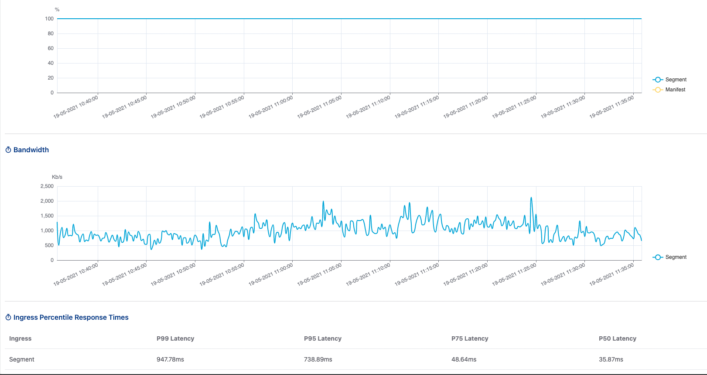
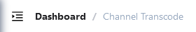
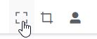
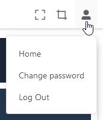
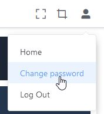

# Menu And Navigator

Có nhiều tùy chọn điều hướng trong Bộ điều khiển. Một số tùy chọn menu phụ thuộc vào phiên bản Sigma OTT mà bạn đã cài đặt.

## Home page and dashboard overviews

Màn hình Dashboard hiển thị các thông tin cơ bản, tổng quan về các dịch vụ đang chạy trên hệ thống. Trong đó:

1. Transcode state

Hiển thị các thông tin tổng quan về dịch vụ **Transcode & Package** 

2. Machine state

Hiển thị các thông tin liên quan đến máy chủ **Transcode & Package**

1. Origin state

Hiển thị thông tin liên quan đến KPI hệ thống Origin bao gồm

*  **Request Rate**: Tỷ lệ request yêu cầu hệ thống
*  **Response success rate**: Tỷ lệ request thành công / thất bại
*  **Bandwidth**: Băng thông hệ thống trả về 
*  **quantile Response Times**: Cung cấp các giá trị **P99**, **P90**, **P50** ứng với các request

* Note: Các request đến Origin được chia làm 2 loại **segment** (Request yêu cầu tập tin media- ts, m4v), **manifest** (request yêu cầu tập tin manifest - m3u8, mpd)

## **Menu panel**

Danh sách menu tính năng hệ thống. Danh sách này sẽ phụ thuộc vào gói tính năng hệ thống mà bạn được cung cấp

{ width=150px }

## Breadcrumb

Breadcrumb hiển thị các liên kết người dùng đã truy cập trước đó. Nội dung breadcrumb hiển thị phía trên của màn hình trình duyệt.

## Header Menu

Bao gồm 3 tùy chọn:

- Bật/tắt chế độ xem toàn bộ màn hình.
- Tùy chỉnh kích thước font chữ.
- Thao tác với tài khoản người dùng.

### Bật/tắt chế độ xem toàn bộ màn hình

Cho phép người dùng bật/tắt chế độ xem toàn bộ màn hình.

Mặc định chế độ này được không được kích hoạt.

Khi được kích hoạt, nội dung ứng dụng sẽ hiển thị tràn ra toàn bộ màn hình.

### Tùy chỉnh kích thước font chữ

Thiết lập kích thước font chữ cho toàn bộ ứng dụng.

Bao gồm 4 tùy chọn `Default`, `Medium`, `Small` và `Mini` tương ứng với 4 kích thước *Mặc định*, *Trung bình*, *Nhỏ* và *Rất nhỏ*.

Sau khi chọn 1 trong 4 tùy chọn trên, kích thước font chữ ứng dụng sẽ thay đổi tương ứng.

### Theo tác với tài khoản người dùng

&ensp;
&ensp;
&ensp;

Cho phép người dùng thao tác với tài khoản sau khi đăng nhập vào hệ thống.

Bao gồm 4 tùy chọn `Home`, `Change password` và `Log out`.

- `Home` điều hướng người dùng về **Trang chủ**.
- `Change password` thay đổi mật khẩu tài khoản người dùng. Tùy chọn này sẽ điều hướng người dùng sang trang **Đổi mật khẩu**.
- `Logout` đăng xuất tài khoản hiện tại và điều hướng người dùng sang trang **Đăng nhập**.

## Danh sách quản lý máy chủ

Mục  **Máy chủ** hiển thị thông tin hệ thống để giám sát và quản lý máy chủ. Các trạng thái của máy chủ gồm:

* **live**: Máy chủ đã đăng kí và còn kết nối đến hệ thống điểu khiển
* **dead**: Máy chủ đã đăng kí nhưng không còn kết nối đến hệ thống điều khiển

Hệ thống **Sigma Transcoder** quản lý 2 dạng máy chủ: 

* **Transcode**: Thực hiện các tác vụ chuyển mã nội dung đa phương tiện
* **Package**: Thực hiện các tác vụ đóng gói 

Trên màn hình giao diện hệ thống bạn có thể liệt kê và theo dõi các máy chủ theo các mục khác nhau

Trong đó: 

| tiêu đề     | Mô tả                                               |
| ----------- | --------------------------------------------------- |
| **#**       | Số thứ tự của máy chủ                               |
| **Machine** | Địa chỉ của máy chủ đăng kí                         |
| **GPU**     | Máy có sử dụng **GPU** hay không                    |
| **CPU**     | Máy có sử dụng **CPU**                              |
| **Task**    | Số lượng tác vụ đang được thực thi trên máy chủ     |
| **Speed**   | Tốc độ thực thi tác vụ thấp nhất trên máy chủ (0-1) |
| **Percent** | % tải của máy chủ đang thực thi tác vụ              |
| **Ram**     | % Ram máy chủ đang sử dụng                          |
| **status**  | Trạng thái của máy chủ **live** hoặc **dead**       |

