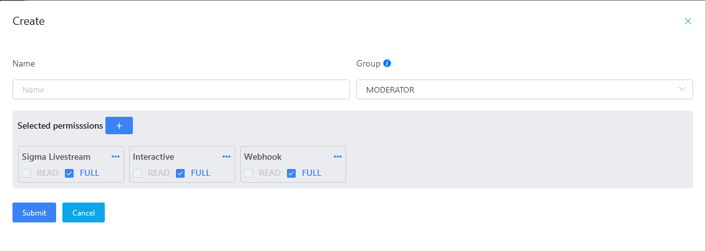
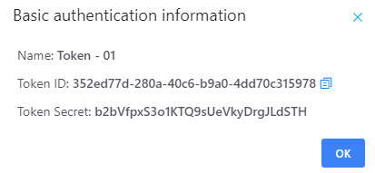
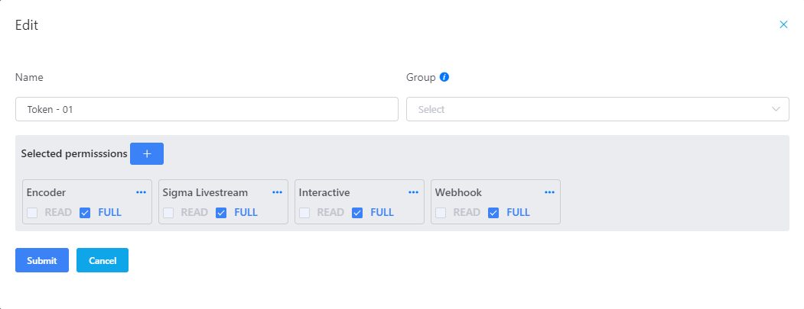
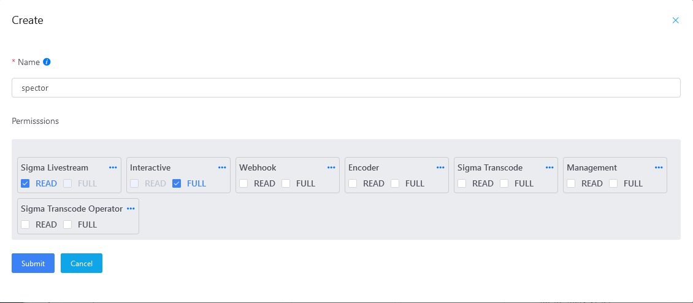
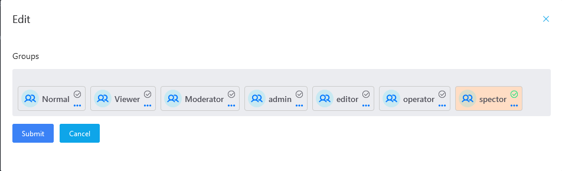

# Management System

Hệ thống quản trị phân quyền người dùng, token truy cập api vào hệ thống

## Basic authentication

Quản lý token dùng trên hệ thống.

### Danh sách basic authentication

Mỗi giá trị token sẽ bao gồm các thông cơ bản:

- Tên.
- Quyền.

  Để hiểu rõ hơn về quyền, truy cập phần **Phân quyền**.

---

**\* NOTE**

Một token sẽ được gán một hoặc nhiều quyền.

---

### Tạo token

1. Nhấp chuột vào nút .
2. Nhập thông tin token trong form.

    

    Khi thực hiện gán quyền cho token, có thể chọn các quyền có sẵn trong danh sách các group. Khi đó, token sẽ thừa kế toàn bộ quyền thuộc nhóm đã chọn. Có thể chỉnh sửa (bổ sung/xóa bỏ) các quyền được thừa kế cho thích hợp.

    Nhấp nút  để hiển thị thêm danh sách các quyền.

    

3. Lưu token  bằng cách nhấp vào nút .

  Hệ thống thực thi tạo mới token:
  - Nếu thành công hiển thị thông tin token vừa tạo:
    

    Nhấp chuột vào các biểu tượng  sao chép Token ID và Token Secret. Giá trị Token Secret sẽ bị xóa đi ngay sau đó

  - Nếu thất bại sẽ hiển thị thông báo lỗi.

### Chỉnh sửa token

Nhấp chuột vào nút  để thay đổi tên, quyền của token.

## Group

Quản lý nhóm người dùng

### Danh sách nhóm

Mỗi nhóm sẽ bao gồm hai thông cơ bản:

- Tên (cột **Name** trong bảng trên).
- Danh sách quyền (cột **Permissions** trong bảng trên).

  Để hiểu rõ hơn về quyền, truy cập phần **Phân quyền**.

---

**\* NOTE**

Một nhóm sẽ bao gồm một hoặc một vài quyền. Những tài khoản trong nhóm được thừa kế toàn bộ quyền thuộc nhóm đó

---

### Tạo nhóm

1. Nhấp chuột vào nút .
2. Nhập thông tin tài khoản trong form.

    

    Thông tin cần nhập bao gồm:
    - Tên.
    - Mật khẩu.
    - Quyền hạn.
3. Lưu nhóm bằng cách nhấp vào nút .

  Hệ thống thực thi tạo mới nhóm:
  - Nếu thành công hiển thị thông báo thành công.
  - Nếu thất bại hiển thị lỗi

### Chỉnh sửa quyền tài khoản

Nhấp chuột vào nút  để chỉnh sửa thông tin tên và quyền của nhóm.

## Member

Quản lý danh sách tài khoản người dùng trên hệ thống.

### Danh sách tài khoản

Mỗi tài khoản sẽ bao gồm một vài thông cơ bản:

- Tên đăng nhập (cột **User** trong bảng trên).
- Nhóm/quyền mà tài khoản được gán(cột **Group** trong bảng trên).

Di chuyển chuột vào nhóm để hiển thị chi tiết quyền.

  

  Để hiểu rõ hơn về quyền, truy cập phần **Phân quyền**.

---

**\* NOTE**

Một tài khoản sẽ là thành viên của một và chỉ một group.

---

### Tạo tài khoản

1. Nhấp chuột vào nút .
2. Nhập thông tin tài khoản trong form.

    

    Thông tin cần nhập bao gồm:
    - Tên đăng nhập.
    - Mật khẩu.
    - Nhóm sẽ trao quyền.

      Nhóm được chọn sẽ hiển thị tick xanh 
3. Lưu tài khoản  bằng cách nhấp vào nút .

  Hệ thống thực thi tạo mới tài khoản:
  - Nếu thành công hiển thị thông tin tài khoản vừa tạo bao gồm tên đăng nhập và mật khẩu:
    

    Nhấp chuột vào các biểu tượng ,   để hiển thị và sao chép mật khẩu.

  - Nếu thất bại sẽ hiển thị thông báo lỗi.

### Chỉnh sửa quyền tài khoản

Nhấp chuột vào nút  để thay đổi quyền của tài khoản bằng cách gán tài khoản vào một nhóm khác.

## Permission

Một tài khoản được tạo và cấp một vài quyền hạn nhất định và chỉ được thực thi các thao tác tương ứng với quyền được cho phép.

### Quy tắc phân quyền

Trên hệ thống sẽ được chia làm nhiều quyền khác nhau, mỗi quyền sẽ bao gồm hai thông tin cơ bản:

- Định danh: nhằm ám chỉ đối tượng, thực thể mà quyền sẽ tác động vào.
  
  Ví dụ, quyền `Sigma Livestream` biểu thị đối tượng mà quyền này tác động vào là luồng `Livestream`.
- Hành động: biểu thị các hành động được cho phép thực thi trên thực thể gán với quyền. Nó chính là việc trả lời câu hỏi *Người dùng có thể thao tác gì với thực thể A?*

  Hệ thống định nghĩa hai hành động để làm việc với quyền:
  - READ: người dùng chỉ có thể xem thông tin thực thể.
  - FULL: người dùng có thể xem và chỉnh sửa thông tin thực thể.

    Khi thiết lập quyền, chỉ có thể chọn lựa một trong hai hành động trên.

Ví dụ giao diện hiển thị một quyền trên hệ thống

  
